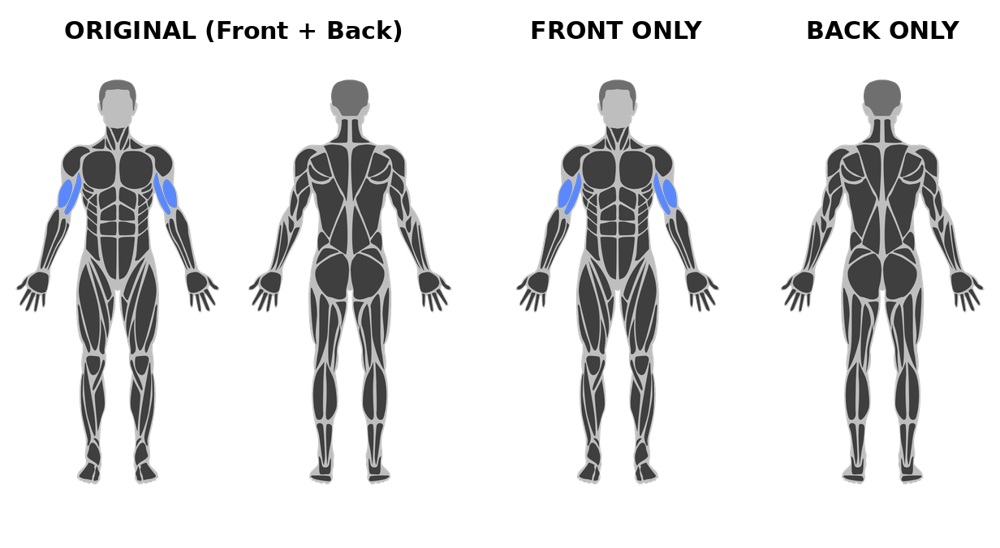

# [Musclegroup Image Generator API](https://rapidapi.com/mertronlp/api/muscle-group-image-generator)

Generates an anatomical image where the requested muscle groups are highlighted on the body in your color of choice. Ideal for Apps and Websites that are centered around sports, exercises, workouts, health and gym. Give your users some visual feedback on what muscle groups they are training by dynamically generating an image that fits perfectly to the current users workout routine.


# API Endpoint Documentation

This documentation provides an overview of all available endpoints in the Muscle Group Image Generator API. Each endpoint returns an image or an appropriate error message in JSON format.

## Recent Changes

### **November 2025 - New Interactive Endpoints**

**New Endpoints Added:**
- `/getMuscleLayer` - Get individual muscle layer images for frontend overlays
- `/getMuscleLayersInfo` - Get JSON with URLs of all available muscle layers

These endpoints enable interactive muscle selection with hover/click functionality in web applications.

---

### **Previous Update - View Parameter**

**New Parameter Added: `view`**

All image endpoints now support an optional `view` parameter that allows you to specify which anatomical view to return:
- `front` - Returns only the front view of the body (960x1920px)
- `back` - Returns only the back view of the body (960x1920px)  
- `both` - Returns both front and back views side by side (1920x1920px) - **default value**

**Backward Compatibility:** All existing API calls continue to work without modification. If you don't specify the `view` parameter, the API will default to `both` (the previous behavior).



## Overview

- [GET /getMuscleGroups](#get-getmusclegroups)
- [GET /getBaseImage](#get-getbaseimage)
- [GET /getImage](#get-getimage)
- [GET /getMulticolorImage](#get-getmulticolorimage)
- [GET /getIndividualColorImage](#get-getindividualcolorimage)
- [GET /getMuscleLayer](#get-getmusclelayer) **New**
- [GET /getMuscleLayersInfo](#get-getmusclelayersinfo) **New**

---

## GET /getMuscleGroups

This endpoint returns a list of all available muscle groups.

### Query Parameters
None.

### Possible Calls
- `/getMuscleGroups`
- `/getMuscleGroups?`

### Example
```bash
curl -X GET "http://localhost/getMuscleGroups"
```

---

## GET /getBaseImage

This endpoint returns the base image (e.g., a silhouette or basic layout).

### Query Parameters
- `transparentBackground` (optional, default `0`): An integer value indicating whether the background should be transparent (`1`) or not (`0`).
- `view` (optional, default `both`): Specifies which view to return. Valid values are `front`, `back`, or `both`.

### Possible Calls
- `/getBaseImage`
- `/getBaseImage?` (no parameters)
- `/getBaseImage?transparentBackground=1`
- `/getBaseImage?transparentBackground=1&view=front`

### Example
```bash
curl -X GET "http://localhost/getBaseImage?transparentBackground=1&view=front"
```

---

## GET /getImage

This endpoint returns an image in which certain muscle groups can be highlighted. An optional custom color can be specified for highlighting the muscles.

### Query Parameters
- `muscleGroups` (**required**): A string specifying which muscles to highlight. Multiple muscle groups can be separated by commas.
- `color` (optional): The color used for highlighting the muscles (e.g., in hex notation `FF0000`).
- `transparentBackground` (optional, default `0`): An integer value indicating whether the background should be transparent (`1`) or not (`0`).
- `view` (optional, default `both`): Specifies which view to return. Valid values are `front`, `back`, or `both`.

### Possible Calls
- `/getImage?muscleGroups=MUSCLE_GROUPS&color=COLOR&transparentBackground=0_or_1`
- `/getImage?muscleGroups=MUSCLE_GROUPS&color=COLOR&transparentBackground=0_or_1&view=front`

&gt; **Note**: If `color` is not specified, a default color is used.

### Example
```bash
curl -X GET "http://localhost/getImage?muscleGroups=biceps,triceps&color=FF0000&transparentBackground=1&view=front"
```

---

## GET /getMulticolorImage

This endpoint produces an image in which two sets of muscle groups are highlighted using different colors.

### Query Parameters
- `primaryMuscleGroups` (**required**): A string containing the primary muscle groups.
- `secondaryMuscleGroups` (**required**): A string containing the secondary muscle groups.
- `primaryColor` (**required**): The color for the primary muscle groups.
- `secondaryColor` (**required**): The color for the secondary muscle groups.
- `transparentBackground` (optional, default `0`): An integer value indicating whether the background should be transparent (`1`) or not (`0`).
- `view` (optional, default `both`): Specifies which view to return. Valid values are `front`, `back`, or `both`.

### Possible Calls
- `/getMulticolorImage?primaryMuscleGroups=GROUPS&secondaryMuscleGroups=GROUPS&primaryColor=COLOR&secondaryColor=COLOR&transparentBackground=0_or_1`
- `/getMulticolorImage?primaryMuscleGroups=GROUPS&secondaryMuscleGroups=GROUPS&primaryColor=COLOR&secondaryColor=COLOR&transparentBackground=0_or_1&view=front`

### Example
```bash
curl -X GET "http://localhost/getMulticolorImage?primaryMuscleGroups=biceps&secondaryMuscleGroups=triceps&primaryColor=FF0000&secondaryColor=00FF00&transparentBackground=1&view=front"
```

---

## GET /getIndividualColorImage

This endpoint allows you to assign individual colors for each muscle group. Both the muscle groups and their colors are provided as comma-separated strings.

### Query Parameters
- `muscleGroups` (**required**): A comma-separated string of muscle groups, for example `biceps,triceps`.
- `colors` (**required**): A comma-separated string of colors, for example `FF0000,00FF00`.
- `transparentBackground` (optional, default `0`): An integer value indicating whether the background should be transparent (`1`) or not (`0`).
- `view` (optional, default `both`): Specifies which view to return. Valid values are `front`, `back`, or `both`.

&gt; **Note**: The number of colors in `colors` should match the number of muscle groups in `muscleGroups`.

### Possible Calls
- `/getIndividualColorImage?muscleGroups=GROUPS&colors=COLORS&transparentBackground=0_or_1`
- `/getIndividualColorImage?muscleGroups=GROUPS&colors=COLORS&transparentBackground=0_or_1&view=front`

### Example
```bash
curl -X GET "http://localhost/getIndividualColorImage?muscleGroups=biceps,triceps&colors=FF0000,00FF00&transparentBackground=1&view=front"
```

---

## GET /getMuscleLayer

**New - Added November 2025**

This endpoint returns an individual muscle layer image without the base body image. Perfect for creating interactive muscle selectors where users can click or hover over specific muscles in the frontend.

### Query Parameters
- `muscleGroup` (**required**): A single muscle group name (e.g., `biceps`, `chest`, `quadriceps`).
- `color` (optional): Custom color for the muscle in hex format (e.g., `FF0000`). If not specified, the default blue color is used.
- `view` (optional, default `both`): Specifies which view to return. Valid values are `front`, `back`, or `both`.

### Use Case
These images are designed to be overlaid on top of the base image in your frontend application. Each muscle layer is a PNG with transparency, allowing you to:
- Create clickable muscle regions
- Show hover effects on specific muscles
- Build interactive anatomy diagrams
- Display muscle activation in real-time

### Possible Calls
- `/getMuscleLayer?muscleGroup=MUSCLE_NAME`
- `/getMuscleLayer?muscleGroup=MUSCLE_NAME&color=FF0000`
- `/getMuscleLayer?muscleGroup=MUSCLE_NAME&color=FF0000&view=front`

### Example
```bash
curl -X GET "http://localhost/getMuscleLayer?muscleGroup=biceps&color=FF0000&view=front"
```

---

## GET /getMuscleLayersInfo

**New - Added November 2025**

This endpoint returns a JSON object containing URLs for all available muscle layers. This is useful for dynamically loading all muscle layers in a web application without hardcoding muscle names.

### Query Parameters
- `view` (optional, default `both`): Specifies which view to return URLs for. Valid values are `front`, `back`, or `both`.
- `color` (optional): Optional default color to apply to all muscle layer URLs (in hex format).

### Response Format
```json
{
  "view": "front",
  "baseImage": "/getBaseImage?view=front",
  "totalMuscles": 28,
  "muscles": [
    {
      "name": "biceps",
      "url": "/getMuscleLayer?muscleGroup=biceps&view=front"
    },
    {
      "name": "triceps",
      "url": "/getMuscleLayer?muscleGroup=triceps&view=front"
    }
    // ... more muscles
  ]
}
```

### Possible Calls
- `/getMuscleLayersInfo`
- `/getMuscleLayersInfo?view=front`
- `/getMuscleLayersInfo?view=front&color=FF0000`

### Example
```bash
curl -X GET "http://localhost/getMuscleLayersInfo?view=front"
```

---

